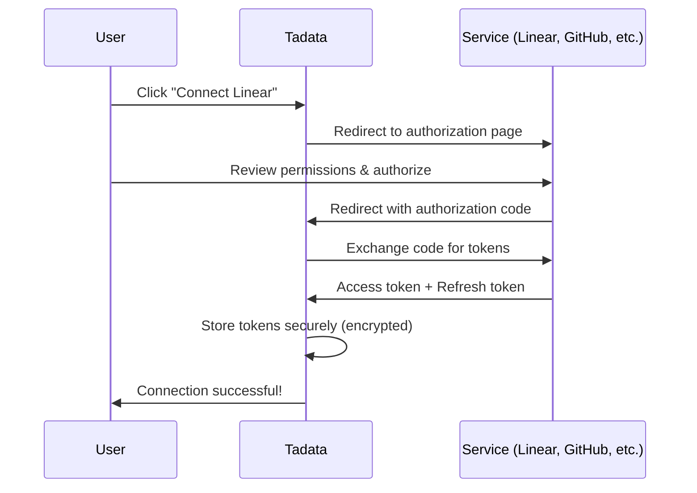
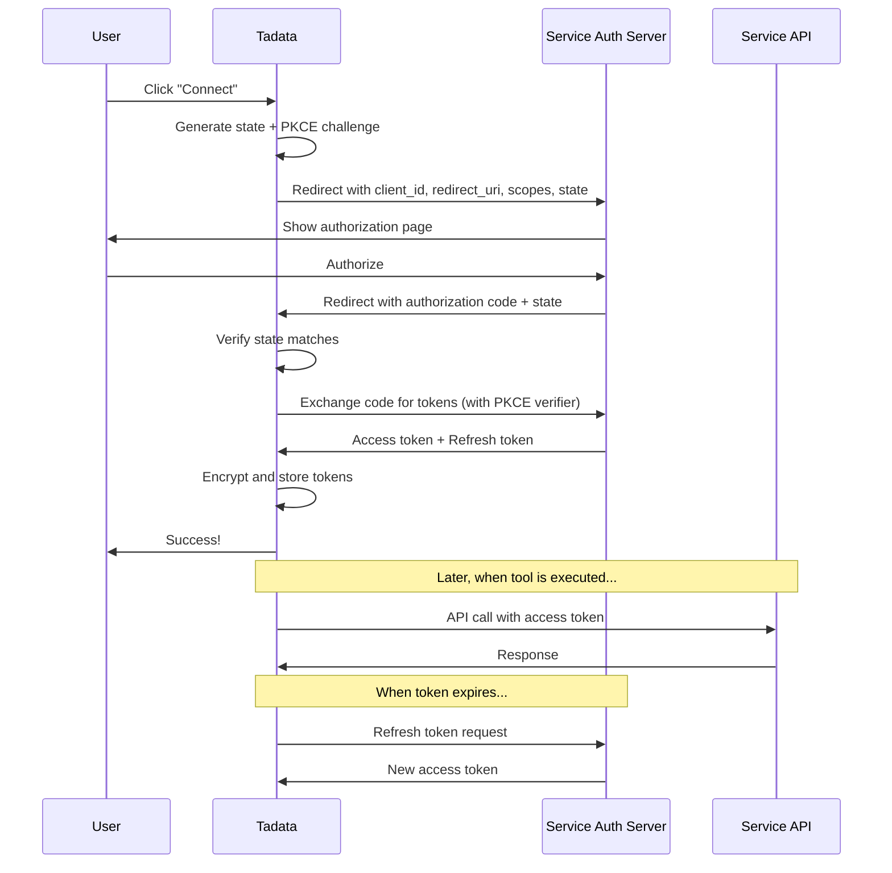

## Overview

**OAuth authentication** provides secure, managed authentication for pre-built connectors. Tadata handles the entire OAuth flow, token storage, and automatic refresh - you just click "Connect" and authorize.

<Check>
  **Recommended for:** All pre-built connectors (Linear, GitHub, Slack, Notion, etc.)
</Check>

## How OAuth Works

### Token Types

| Token Type | Lifespan | Purpose | Storage |
|------------|----------|---------|---------|
| **Access Token** | Short (hours/days) | Make API calls | Encrypted in Tadata vault |
| **Refresh Token** | Long (months/years) | Get new access tokens | Encrypted in Tadata vault |

## Step-by-Step Setup

### Step 1: Browse Connectors

1. Navigate to **Connectors** in your dashboard
2. Find a connector with OAuth support (look for the OAuth badge)
3. Click the connector to view details

<Info>
  Most popular connectors support OAuth: Linear, GitHub, Slack, Notion, Google Drive, Microsoft 365, etc.
</Info>

### Step 2: Click Connect

1. Click the **Connect** button
2. A popup/tab will open to the service's authorization page

<Tip>
  **Popup Blockers:** If nothing happens, check that popup blockers are disabled for Tadata.
</Tip>

### Step 3: Review Permissions

The service will show requested permissions (scopes):

<Tabs>
  <Tab title="Linear">
    **Tadata requests:**
    - `read:issues` - Read issues and comments
    - `write:issues` - Create and update issues
    - `read:projects` - Access project information

    **What this means:** Tadata can read and write issues on your behalf.
  </Tab>

  <Tab title="GitHub">
    **Tadata requests:**
    - `repo` - Access repositories
    - `read:user` - Read user profile
    - `write:discussion` - Participate in discussions

    **What this means:** Tadata can access your repos and create PRs, issues, etc.
  </Tab>

  <Tab title="Slack">
    **Tadata requests:**
    - `chat:write` - Send messages
    - `channels:read` - List channels
    - `channels:history` - Read message history

    **What this means:** Tadata can send messages and read channel information.
  </Tab>
</Tabs>

<Warning>
  **Review Carefully:** Only authorize if you're comfortable with the requested permissions.
</Warning>

### Step 4: Select Workspace/Organization

Some services require selecting a workspace or organization:

- **Linear:** Choose workspace (e.g., "Acme Corp")
- **Slack:** Choose workspace and default channel
- **GitHub:** Choose organization or personal account
- **Notion:** Choose workspace and pages to share

### Step 5: Authorize

Click **Authorize** or **Allow** to grant permissions.

### Step 6: Redirect Back to Tadata

You'll be redirected back to Tadata with a success message:

<Check>
  ✅ Successfully connected Linear!

  Your account is now authorized and ready to use.
</Check>

### Step 7: Configure Tools

Select which tools to enable from the connected service:

- **Enable All** (recommended for getting started)
- **Select Specific Tools** (for more control)

Then create a new toolset or add to an existing one.

## Token Management

### Automatic Token Refresh

Tadata automatically refreshes tokens when they expire:

<Steps>
  <Step title="Token Expires">
    Access token reaches its expiration time
  </Step>

  <Step title="API Call Fails">
    Service returns 401 Unauthorized
  </Step>

  <Step title="Tadata Detects Expiration">
    Recognizes the 401 as token expiration (not auth failure)
  </Step>

  <Step title="Request New Token">
    Uses refresh token to request a new access token from the service
  </Step>

  <Step title="Update Stored Token">
    Stores the new access token securely
  </Step>

  <Step title="Retry Original Request">
    Retries the failed API call with the new token
  </Step>
</Steps>

**This happens automatically. You never have to manually refresh tokens.**

### Token Security

<AccordionGroup>
  <Accordion title="Encrypted Storage" icon="lock">
    All tokens are encrypted at rest using industry-standard encryption (AES-256).

    Only Tadata's backend services can decrypt tokens, and only when needed for API calls.
  </Accordion>

  <Accordion title="Secure Transmission" icon="shield">
    Tokens are transmitted over HTTPS only. They're never logged or exposed in URLs.
  </Accordion>

  <Accordion title="Limited Scopes" icon="user-shield">
    Tokens are scoped to specific permissions you authorize. Even if a token is compromised, it can only perform authorized actions.
  </Accordion>

  <Accordion title="Revocable" icon="trash">
    You can revoke access anytime:
    - In Tadata: Settings → Connected Accounts → Disconnect
    - In service: Revoke "Tadata" OAuth app in settings

    Revoked tokens immediately stop working.
  </Accordion>
</AccordionGroup>

## Managing Connected Accounts

### View Connected Accounts

1. Navigate to **Settings** → **Connected Accounts**
2. See all OAuth connections:
   - Service name and logo
   - Connected user/email
   - Workspace/organization
   - Connection date
   - Last used timestamp
   - Status (Active, Expired, Error)

### Reconnect Account

If a token expires or fails:

1. You'll see an error status in Connected Accounts
2. Click **Reconnect**
3. Re-authorize with the service
4. Your toolsets start working again immediately

<Info>
  Tadata sends email notifications if a connection fails and needs reconnection.
</Info>

### Disconnect Account

To remove a connection:

1. Find the account in **Connected Accounts**
2. Click **Disconnect**
3. Confirm the action

<Warning>
  **This will break toolsets using this connection.** Only disconnect if you're sure.
</Warning>

## OAuth vs. Service Account

<CardGroup cols={2}>
  <Card title="Personal OAuth (Default)">
    **Connect your personal account**

    **Pros:**
    - Easy setup
    - Actions appear under your name
    - Good for individual use

    **Cons:**
    - Tied to your account (if you leave, toolsets break)
    - Personal permissions (may be too broad or too narrow)
  </Card>

  <Card title="Service Account OAuth">
    **Create a dedicated bot account**

    **Pros:**
    - Not tied to any individual
    - Easier to audit (all bot actions clearly identified)
    - Controlled permissions (grant only what the bot needs)

    **Cons:**
    - Requires creating a separate account (may incur costs)
    - More setup steps

    **Recommended for production use**
  </Card>
</CardGroup>

### Creating a Service Account

<Steps>
  <Step title="Create Bot Account">
    In the service (Linear, GitHub, Slack), create a new user:
    - Email: `tadata-bot@company.com`
    - Name: "Tadata Bot" or "AI Agent Bot"
  </Step>

  <Step title="Grant Permissions">
    Give the bot account minimum necessary permissions:
    - Linear: Member of relevant teams
    - GitHub: Collaborator on specific repos
    - Slack: Member of relevant channels
  </Step>

  <Step title="Connect in Tadata">
    Log in as the bot account and authorize Tadata (or use the bot's credentials in an incognito window)
  </Step>

  <Step title="Verify">
    Test in Playground - actions should appear under the bot's name
  </Step>
</Steps>

## Troubleshooting

<AccordionGroup>
  <Accordion title="Popup Blocked During Authorization">
    **Symptoms:** Clicking "Connect" does nothing

    **Solutions:**
    - Allow popups for `app.tadata.com`
    - Try again
    - Or use incognito/private browsing mode
  </Accordion>

  <Accordion title="Authorization Fails with Error">
    **Symptoms:** Redirects back with error message

    **Common Errors:**
    - **"access_denied"**: You clicked Cancel or denied permissions
    - **"invalid_scope"**: Service doesn't support requested permissions
    - **"unauthorized_client"**: Tadata OAuth app not configured correctly

    **Solutions:**
    - Try authorizing again
    - Contact support if error persists
  </Accordion>

  <Accordion title="Token Expired, Won't Auto-Refresh">
    **Symptoms:** Tools fail with 401, reconnect doesn't help

    **Possible Causes:**
    - Refresh token was revoked
    - Service changed OAuth implementation
    - Account permissions changed

    **Solutions:**
    - Disconnect and reconnect the account
    - Verify account still has access to resources
    - Check service status (OAuth API down?)
  </Accordion>

  <Accordion title="Wrong Workspace/Organization Connected">
    **Symptoms:** Tools can't find expected resources

    **Solutions:**
    - Disconnect the account
    - Reconnect and carefully select the correct workspace
    - Some services allow changing workspace without full reconnect (check Settings)
  </Accordion>

  <Accordion title="Insufficient Permissions">
    **Symptoms:** Some tools work, others fail with 403 Forbidden

    **Solutions:**
    - Review scopes granted during authorization
    - Disconnect and reconnect with broader scopes
    - Check if service added new required permissions
    - Verify connected account has access to the resources
  </Accordion>
</AccordionGroup>

## OAuth Flow Diagram

For technical details, here's the complete OAuth 2.0 flow:

## Security Best Practices

<AccordionGroup>
  <Accordion title="Review Permissions Regularly" icon="clipboard-check">
    Every 3-6 months:
    1. Review connected accounts
    2. Check if permissions are still necessary
    3. Revoke unused connections
    4. Consider reducing scopes if over-permissioned
  </Accordion>

  <Accordion title="Use Service Accounts for Production" icon="robot">
    Don't tie production toolsets to personal accounts. Use dedicated service accounts to:
    - Avoid breakage when people leave
    - Maintain clear audit trails
    - Control permissions independently
  </Accordion>

  <Accordion title="Monitor OAuth Audit Logs" icon="eye">
    Most services provide OAuth audit logs:
    - When Tadata accessed your account
    - What actions were performed
    - Any errors or unauthorized attempts

    Review these logs regularly to detect anomalies.
  </Accordion>

  <Accordion title="Revoke Unused Connections" icon="trash">
    If you're not using a toolset anymore:
    1. Archive the toolset in Tadata
    2. Disconnect the OAuth account
    3. Revoke Tadata app in the service

    Fewer connections = smaller attack surface.
  </Accordion>
</AccordionGroup>

## Supported Services

OAuth is available for 40+ services including:

<CardGroup cols={3}>
  <Card title="Linear" icon="grid-2">
    Issue tracking
  </Card>
  <Card title="GitHub" icon="github">
    Code repositories
  </Card>
  <Card title="Slack" icon="slack">
    Team communication
  </Card>
  <Card title="Notion" icon="file">
    Knowledge base
  </Card>
  <Card title="Google Drive" icon="google">
    File storage
  </Card>
  <Card title="Microsoft 365" icon="microsoft">
    Office suite
  </Card>
  <Card title="Supabase" icon="database">
    Backend platform
  </Card>
  <Card title="Render" icon="server">
    Hosting
  </Card>
  <Card title="Attio" icon="address-book">
    CRM
  </Card>
</CardGroup>

[View full list of connectors →](/connectors/introduction)

## Next Steps

<CardGroup cols={2}>
  <Card title="Test in Playground" icon="flask" href="/guides/testing-playground">
    Verify your OAuth connection is working
  </Card>
  <Card title="Using Connectors" icon="plug" href="/guides/using-connectors">
    Learn more about pre-built connectors
  </Card>
  <Card title="View Analytics" icon="chart-line" href="/optimization/analytics">
    Monitor tool usage and errors
  </Card>
  <Card title="Bring Your Own API" icon="code" href="/guides/bringing-your-own">
    Add custom APIs with OpenAPI specs
  </Card>
</CardGroup>
