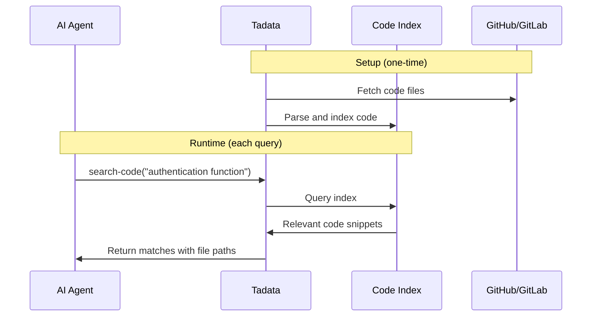

## Overview

**Code Indexing** enables AI agents to search code repositories without loading entire codebases into context. The `search-code` tool allows agents to find functions, classes, patterns, and implementations across your codebase.

<Check>
  **Perfect for:** Debugging, code review, refactoring, finding examples, development workflows
</Check>

## How It Works



**Benefits:**
- **Fast**: Pre-indexed, sub-second searches
- **Context-Aware**: Understands code structure (functions, classes, imports)
- **Token Efficient**: Returns only relevant snippets, not entire files

## Setup

### Step 1: Enable Code Indexing

1. Navigate to your toolset
2. Go to **Configuration** tab
3. Find **Code Indexing** section
4. Toggle **Enable** to ON

<Info>
  Code indexing requires the **Code Indexing** feature flag enabled for your organization. Contact support if you don't see this option.
</Info>

### Step 2: Connect Repository

<Tabs>
  <Tab title="GitHub">
    1. Click **Connect GitHub** (OAuth)
    2. Select repository (e.g., `company/backend`)
    3. Choose branch(es) to index (e.g., `main`, `develop`)
    4. Select paths to include/exclude

    **Automatic Exclusions:**
    - `node_modules/`
    - `.git/`
    - `dist/`, `build/`, `out/`
    - Binary files
    - Files from `.gitignore`
  </Tab>

  <Tab title="GitLab">
    1. Click **Connect GitLab** (OAuth)
    2. Select project
    3. Choose branch(es)
    4. Configure paths

    **Same exclusions as GitHub**
  </Tab>

  <Tab title="Multiple Repositories">
    Index multiple repos in one toolset:

    1. Add first repository (GitHub or GitLab)
    2. Click **Add Another Repository**
    3. Repeat for each repo
    4. All repos searchable via single `search-code` tool
  </Tab>
</Tabs>

### Step 3: Configure Indexing

**Path Filters** (optional):

```yaml Include Only
paths:
  include:
    - src/
    - lib/
  exclude:
    - src/generated/
    - lib/vendor/
```

**Languages** (auto-detected):
- JavaScript/TypeScript
- Python
- Go
- Java
- Rust
- Ruby
- PHP
- C/C++
- And more...

### Step 4: Index Repository

1. Click **Start Indexing**
2. Wait for indexing (typically 2-10 minutes depending on repo size)
3. Progress bar shows:
   - Cloning repository
   - Parsing files
   - Building code index

<Tip>
  **Large Repos:** Repositories with 100,000+ files may take 30+ minutes to index.
</Tip>

### Step 5: Test Search

Open **Playground** and test:

```text Example Queries
Find the authentication function
Show me where we handle user login
Search for error handling in payment processing
Find all API endpoint definitions
```

## Using search-code Tool

### Tool Definition

```json
{
  "name": "search-code",
  "description": "Search code repositories for functions, classes, and implementations",
  "parameters": {
    "query": {
      "type": "string",
      "required": true,
      "description": "Search query (function name, class, keyword, or natural language)"
    },
    "language": {
      "type": "string",
      "required": false,
      "description": "Filter by language (js, py, go, etc.)"
    },
    "limit": {
      "type": "integer",
      "required": false,
      "description": "Number of results (default: 10, max: 50)"
    }
  }
}
```

### Example Usage

<Tabs>
  <Tab title="Debugging Agent">
    **Scenario:** Error in production, need to find relevant code

    ```text Agent Workflow
    1. Get error from Sentry: "TypeError in processPayment"
    2. search-code("processPayment function")
    3. Results: src/payments/processor.ts:45
    4. Analyze code for bug
    5. Create Linear issue with file/line reference
    ```

    **Agent Output:** "Found processPayment in src/payments/processor.ts:45. Issue appears to be missing null check on paymentMethod parameter. Created LINEAR-123."
  </Tab>

  <Tab title="Code Review Agent">
    **Scenario:** Review PR for similar patterns

    ```text Agent Workflow
    1. PR modifies authentication logic
    2. search-code("authentication middleware")
    3. Find existing auth implementations
    4. Compare patterns
    5. Suggest improvements
    ```

    **Agent Comment:** "This auth pattern looks good, but consider using the centralized validateToken() from src/auth/utils.ts:23 instead of reimplementing."
  </Tab>

  <Tab title="Development Agent">
    **Scenario:** Developer asks how to implement a feature

    ```text Agent Workflow
    User: "How do I add rate limiting?"
    1. search-code("rate limit middleware")
    2. Find: src/middleware/rateLimit.ts
    3. Extract example usage
    4. Provide code snippet with explanation
    ```

    **Agent Response:** "We have a rate limiting middleware at src/middleware/rateLimit.ts. Here's how to use it: [code snippet]"
  </Tab>
</Tabs>

### Response Format

```json Example Response
{
  "results": [
    {
      "file": "src/auth/login.ts",
      "line": 45,
      "snippet": "export async function authenticateUser(email: string, password: string) {\n  const user = await db.users.findByEmail(email);\n  if (!user) throw new Error('User not found');\n  ...",
      "language": "typescript",
      "score": 0.95
    },
    {
      "file": "src/auth/middleware.ts",
      "line": 12,
      "snippet": "export const requireAuth = async (req, res, next) => {\n  const token = req.headers.authorization;\n  if (!token) return res.status(401).json({error: 'Unauthorized'});\n  ...",
      "language": "typescript",
      "score": 0.88
    }
  ]
}
```

## Reindexing

Code changed? Reindex to update the search index:

### Manual Reindex

1. Go to toolset **Configuration**
2. Find **Code Indexing**
3. Click **Reindex Now**
4. Wait for completion

<Tip>
  Reindex after major code changes (new features, refactoring) to keep index fresh.
</Tip>

### Automatic Reindex (Webhook-Based)

For enterprise customers, set up automatic reindexing:

**GitHub:**
- Webhook triggers reindex on push to `main` or selected branches
- Incremental indexing (only changed files)
- Completes in seconds for most commits

**GitLab:**
- Similar webhook-based auto-reindex
- Configure in repository settings

Contact sales for webhook-based auto-indexing.

## Best Practices

<AccordionGroup>
  <Accordion title="Index Only Relevant Code" icon="filter">
    **Include:**
    - `src/` - Application code
    - `lib/` - Libraries
    - `api/` - API endpoints

    **Exclude:**
    - `node_modules/` - Dependencies (indexed automatically)
    - `test/` - Test files (usually not needed)
    - `dist/`, `build/` - Generated code
    - `docs/` - Documentation (use knowledge indexing instead)
  </Accordion>

  <Accordion title="Use Descriptive Function/Class Names" icon="tag">
    Search works better with clear names:

    ✅ **Good:**
    ```typescript
    function authenticateUser(email, password) { }
    class PaymentProcessor { }
    ```

    ❌ **Bad:**
    ```typescript
    function doAuth(e, p) { }
    class PP { }
    ```

    Good naming improves search accuracy.
  </Accordion>

  <Accordion title="Add Comments for Context" icon="comment">
    Comments help AI agents understand code:

    ```typescript
    /**
     * Authenticates user with email and password.
     * Returns JWT token on success.
     * Throws error if credentials are invalid.
     */
    function authenticateUser(email: string, password: string): string {
      // ...
    }
    ```

    Searchable by comments too!
  </Accordion>

  <Accordion title="Organize Code Logically" icon="folder-tree">
    Good file structure helps search:

    ```
    src/
      auth/        # All auth-related code
      payments/    # Payment processing
      api/         # API endpoints
      utils/       # Utilities
    ```

    Agents can find code by module.
  </Accordion>

  <Accordion title="Reindex After Major Changes" icon="arrows-rotate">
    **When to reindex:**
    - After feature branches merge
    - After refactoring
    - After adding new modules
    - Weekly (if code changes frequently)

    **When NOT to reindex:**
    - After every commit (too frequent)
    - For typo fixes
    - For comment-only changes
  </Accordion>
</AccordionGroup>

## Troubleshooting

<AccordionGroup>
  <Accordion title="Indexing Fails">
    **Symptoms:** "Indexing failed" error

    **Causes:**
    - Repository is private (needs auth)
    - Repository is too large (>500,000 files)
    - OAuth permissions insufficient

    **Solutions:**
    - Verify GitHub/GitLab OAuth connection
    - Exclude unnecessary directories
    - Contact support for large repositories
  </Accordion>

  <Accordion title="Search Returns No Results">
    **Symptoms:** `search-code` returns empty array

    **Causes:**
    - Index is empty
    - Query doesn't match any code
    - Indexed wrong branch

    **Solutions:**
    - Verify indexing completed
    - Try broader search terms
    - Check that correct branch is indexed
    - Reindex
  </Accordion>

  <Accordion title="Search Returns Too Many Results">
    **Symptoms:** 50+ matches, hard to find relevant code

    **Solutions:**
    - Be more specific in query ("login function" vs "function")
    - Filter by language: `search-code("login", language="typescript")`
    - Filter by path (coming soon)
    - Reduce limit parameter
  </Accordion>

  <Accordion title="Search Misses Obvious Code">
    **Symptoms:** Function exists but search doesn't find it

    **Causes:**
    - Code added after indexing
    - File was excluded (in .gitignore)
    - Function/class name doesn't match query

    **Solutions:**
    - Reindex to include recent changes
    - Check exclusion rules
    - Try alternative search terms
  </Accordion>
</AccordionGroup>

## Security & Privacy

<AccordionGroup>
  <Accordion title="Repository Access" icon="lock">
    **What Tadata Can Access:**
    - Repositories you explicitly authorize
    - Only branches you select for indexing

    **What Tadata CANNOT Access:**
    - Other repositories in your organization
    - Private branches not selected
    - Repository settings or webhooks
  </Accordion>

  <Accordion title="Code Storage" icon="database">
    **Indexed Data:**
    - Code snippets stored in search index
    - Encrypted at rest
    - Deleted when you disconnect repository

    **Not Stored:**
    - Full repository clones
    - Git history
    - Commit messages
  </Accordion>

  <Accordion title="Who Can Search" icon="users">
    **Access Control:**
    - Only users in your Tadata organization
    - Only toolsets you've configured
    - AI agents using your toolsets

    **Not Accessible:**
    - Other Tadata customers
    - Public search engines
    - Tadata employees (without explicit permission)
  </Accordion>
</AccordionGroup>

## Use Cases

### Debugging Workflow

```text
1. Error occurs: "Cannot read property 'processPayment' of undefined"
2. Agent: search-code("processPayment")
3. Found: src/payments/processor.ts:45
4. Agent analyzes code, identifies null pointer issue
5. Agent creates Linear issue with file/line reference
```

### Code Review Workflow

```text
1. PR opened: "Add user authentication"
2. Agent: search-code("authentication")
3. Finds existing auth patterns
4. Compares PR code with existing patterns
5. Agent suggests: "Consider using existing validateToken utility"
```

### Development Workflow

```text
1. Developer: "How do I add rate limiting?"
2. Agent: search-code("rate limit middleware")
3. Finds: src/middleware/rateLimit.ts
4. Agent provides example usage
5. Developer implements using existing pattern
```

## Next Steps

<CardGroup cols={2}>
  <Card title="Enable Knowledge Indexing" icon="book" href="/optimization/knowledge-indexing">
    Add documentation search alongside code search
  </Card>
  <Card title="View Analytics" icon="chart-line" href="/optimization/analytics">
    Track search-code usage
  </Card>
  <Card title="Test in Playground" icon="flask" href="/guides/testing-playground">
    Test code search queries
  </Card>
  <Card title="Triage Recipe" icon="bug" href="/recipes/triage-agent">
    See code indexing in production triage workflow
  </Card>
</CardGroup>
