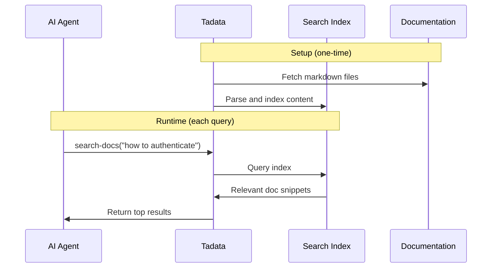

## Overview

**Knowledge Indexing** enables your AI agents to search documentation without loading entire docs into context. The `search-docs` tool allows agents to query indexed content and retrieve only relevant snippets.

<Check>
  **Perfect for:** Product documentation, internal wikis, API references, knowledge bases
</Check>

## How It Works



**Benefits:**
- **Token Efficient**: Only relevant snippets returned, not entire docs
- **Fast**: Pre-indexed, sub-second queries
- **Accurate**: Semantic search finds relevant content even with different phrasing

## Setup

### Step 1: Enable Knowledge Indexing

1. Navigate to your toolset
2. Go to **Configuration** tab
3. Find **Knowledge Indexing** section
4. Toggle **Enable** to ON

### Step 2: Connect Documentation Source

Choose your documentation source:

<Tabs>
  <Tab title="GitHub Repository">
    **Best for:** Docs hosted in GitHub (markdown files)

    1. Select **GitHub Repository**
    2. Click **Connect GitHub** (OAuth)
    3. Select repository (e.g., `company/docs`)
    4. Choose branch (e.g., `main`)
    5. Specify docs directory (e.g., `/docs`, or `/` for root)

    **Supported Formats:**
    - Markdown (`.md`, `.mdx`)
    - Plain text (`.txt`)
  </Tab>

  <Tab title="Public URL">
    **Best for:** Documentation sites, static sites

    1. Select **Public URL**
    2. Enter documentation URL (e.g., `https://docs.yoursite.com`)
    3. Tadata will crawl and index pages

    **Supported:**
    - Static documentation sites
    - GitBook, Docusaurus, VitePress, etc.
    - Any public HTML pages
  </Tab>

  <Tab title="GitBook">
    **Best for:** GitBook-hosted documentation

    1. Select **GitBook**
    2. Enter space ID or URL
    3. Provide API key (if private)
    4. Index

    **Automatic sync** with GitBook updates.
  </Tab>

  <Tab title="Notion">
    **Best for:** Notion-based knowledge bases

    1. Select **Notion**
    2. Connect Notion account (OAuth)
    3. Select workspace and pages to index
    4. Index

    **Note:** Notion pages must be shared with Tadata integration.
  </Tab>
</Tabs>

### Step 3: Index Documentation

1. Click **Start Indexing**
2. Wait for indexing to complete (typically 1-5 minutes)
3. Progress bar shows status:
   - Fetching files
   - Parsing content
   - Building search index

<Info>
  Indexing time depends on documentation size. Large docs (1000+ pages) may take 10-15 minutes.
</Info>

### Step 4: Test Search

1. Open **Playground**
2. The `search-docs` tool is now available
3. Test queries:

```text Example Queries
Search docs for "authentication guide"
Find information about API rate limits
How do I reset my password?
```

<Check>
  If results look relevant, you're all set!
</Check>

## Using search-docs Tool

### Tool Definition

```json
{
  "name": "search-docs",
  "description": "Search product documentation for relevant information",
  "parameters": {
    "query": {
      "type": "string",
      "required": true,
      "description": "Search query (keywords or natural language question)"
    },
    "limit": {
      "type": "integer",
      "required": false,
      "description": "Number of results to return (default: 5, max: 20)"
    }
  }
}
```

### Example Usage

<Tabs>
  <Tab title="Support Agent">
    **User Question:** "How do I reset my password?"

    **Agent Workflow:**
    1. Call `search-docs("password reset")`
    2. Receive relevant doc snippets
    3. Synthesize answer from snippets
    4. Provide link to full documentation

    **Agent Response:** "To reset your password, go to Settings → Security → Reset Password. You'll receive an email with a reset link. [Full Guide](https://docs.yoursite.com/auth/password-reset)"
  </Tab>

  <Tab title="Development Agent">
    **Developer Question:** "What's the API rate limit?"

    **Agent Workflow:**
    1. Call `search-docs("API rate limit")`
    2. Find: "API requests are limited to 1000 per hour per API key"
    3. Provide answer with source

    **Agent Response:** "The API rate limit is 1000 requests per hour per API key. [Source](https://docs.yoursite.com/api/limits)"
  </Tab>

  <Tab title="Triage Agent">
    **Scenario:** Production error, need context

    **Agent Workflow:**
    1. Get error from Sentry
    2. Call `search-docs("error code XYZ")`
    3. Find troubleshooting guide
    4. Apply fix or escalate with context

    **Agent Action:** "Error XYZ is caused by database connection timeout. Docs suggest checking connection pool settings. Creating issue with docs link..."
  </Tab>
</Tabs>

### Response Format

```json Example Response
{
  "results": [
    {
      "title": "Authentication Guide",
      "url": "https://docs.yoursite.com/auth",
      "snippet": "To authenticate API requests, include your API key in the Authorization header: Bearer YOUR_API_KEY...",
      "score": 0.92
    },
    {
      "title": "API Keys",
      "url": "https://docs.yoursite.com/api-keys",
      "snippet": "Generate API keys in your dashboard under Settings → API. Keys have the format sk_live_... for production...",
      "score": 0.85
    }
  ]
}
```

## Reindexing

Documentation changes? Reindex to update the search index:

### Manual Reindex

1. Go to toolset **Configuration**
2. Find **Knowledge Indexing**
3. Click **Reindex Now**
4. Wait for completion (usually faster than initial index)

<Tip>
  Reindex after major documentation updates to ensure agents have latest information.
</Tip>

### Automatic Reindex (Enterprise)

For enterprise customers:

- **GitHub:** Webhook-based auto-reindex on commits
- **GitBook:** Auto-sync on publish
- **Notion:** Periodic sync (hourly or daily)
- **Custom:** Trigger reindex via API

Contact sales for automatic reindexing.

## Best Practices

<AccordionGroup>
  <Accordion title="Structure Docs Well" icon="sitemap">
    Good documentation structure improves search:

    **Use Clear Headings:**
    ```markdown
    # Authentication
    ## API Keys
    ### Generating API Keys
    ```

    **Include Keywords:**
    Write for humans, but include terms users will search for.

    **Use Descriptive Filenames:**
    - ✅ `authentication-guide.md`
    - ❌ `doc1.md`
  </Accordion>

  <Accordion title="Keep Docs Concise" icon="file-lines">
    Search works best with focused content:
    - Break long pages into sections
    - Use paragraphs (not walls of text)
    - Include examples and code snippets
    - Link to related pages

    **Tip:** Aim for 500-2000 words per page.
  </Accordion>

  <Accordion title="Index Only Relevant Content" icon="filter">
    Don't index:
    - Generated API reference (use OpenAPI instead)
    - Changelog/release notes (too noisy)
    - Legal pages (T&C, Privacy Policy)
    - Marketing content

    **Focus on:**
    - How-to guides
    - Troubleshooting
    - Concepts and architecture
    - Best practices
  </Accordion>

  <Accordion title="Test Search Quality" icon="magnifying-glass">
    After indexing, test with common questions:
    - "how to..."
    - "error message X"
    - "configure Y"

    If results are poor:
    - Improve documentation (add keywords, clarify language)
    - Reindex
    - Adjust search parameters
  </Accordion>

  <Accordion title="Reindex Regularly" icon="arrows-rotate">
    **Recommended Schedule:**
    - After major doc updates: Immediately
    - Weekly: If docs change frequently
    - Monthly: If docs are stable

    Set calendar reminders or use automatic reindexing.
  </Accordion>
</AccordionGroup>

## Troubleshooting

<AccordionGroup>
  <Accordion title="Indexing Fails">
    **Symptoms:** "Indexing failed" error

    **Causes:**
    - GitHub repo is private (needs auth)
    - URL is not accessible
    - No markdown files found
    - Rate limited by source

    **Solutions:**
    - Verify repo/URL permissions
    - Check that files exist in specified directory
    - Ensure markdown files (`.md` or `.mdx`)
    - Wait and retry if rate limited
  </Accordion>

  <Accordion title="Search Returns No Results">
    **Symptoms:** `search-docs` returns empty array

    **Causes:**
    - Index is empty (no docs indexed)
    - Query doesn't match any content
    - Search is case-sensitive (shouldn't be, but check)

    **Solutions:**
    - Verify indexing completed successfully
    - Try broader search terms
    - Check that docs contain relevant content
    - Reindex if docs were updated
  </Accordion>

  <Accordion title="Search Returns Irrelevant Results">
    **Symptoms:** Results don't match query

    **Causes:**
    - Documentation has poor keyword coverage
    - Query is too vague
    - Search algorithm tuning needed

    **Solutions:**
    - Improve documentation (add keywords, synonyms)
    - Be more specific in queries
    - Contact support for search tuning
  </Accordion>

  <Accordion title="Reindex Takes Too Long">
    **Symptoms:** Indexing stuck or very slow (>30 minutes)

    **Causes:**
    - Very large documentation (>5000 pages)
    - Slow source (network issues)
    - Tadata service degradation

    **Solutions:**
    - Check source availability
    - Try indexing smaller subset first
    - Contact support if persistent
  </Accordion>
</AccordionGroup>

## Use Cases

### Support Agent with Knowledge Base

```text Agent Workflow
User: "How do I export my data?"
Agent: search-docs("export data")
Results: "Data Export Guide" + "CSV Export" + "API Export"
Agent: "You can export data via Settings → Export or use our API..."
```

### Development Agent with API Docs

```text Agent Workflow
Developer: "How do I paginate API results?"
Agent: search-docs("API pagination")
Results: "API Reference - Pagination" + "Best Practices"
Agent: "Use the page and limit query parameters: GET /api/users?page=2&limit=50"
```

### Triage Agent with Troubleshooting Docs

```text Agent Workflow
Error detected in Sentry: "Database connection timeout"
Agent: search-docs("database connection timeout")
Results: "Troubleshooting Database Issues"
Agent: Creates Linear issue with troubleshooting doc link
```

## Next Steps

<CardGroup cols={2}>
  <Card title="Enable Code Indexing" icon="code" href="/optimization/code-indexing">
    Add code search for development workflows
  </Card>
  <Card title="View Analytics" icon="chart-line" href="/optimization/analytics">
    Track search-docs usage and effectiveness
  </Card>
  <Card title="Test in Playground" icon="flask" href="/guides/testing-playground">
    Test search queries interactively
  </Card>
  <Card title="Recipes" icon="book-open" href="/recipes/introduction">
    See knowledge indexing in action
  </Card>
</CardGroup>
